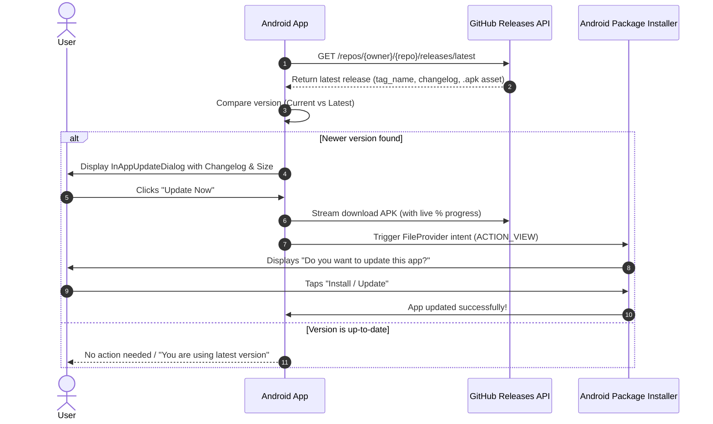

# 🚀 DASMO Apps - Update, Release & Database Management Guide

This documentation serves as the single source of truth for both developers, cyber café owners, and AI agents managing **DASMO CYBER CAFE TOOL** and **DASMO PHOTO PRINT**.

---

## 📌 Table of Contents
1. [Zero-Cost Firebase Spark Plan Architecture](#1-zero-cost-firebase-spark-plan-architecture)
2. [How the In-App GitHub Updater Works](#2-how-the-in-app-github-updater-works)
3. [Step-by-Step Guide: Publishing a New Update](#3-step-by-step-guide-publishing-a-new-update)
4. [Critical & Mandatory Updates](#4-critical--mandatory-updates)
5. [Device Binding & Security Rules](#5-device-binding--security-rules)
6. [Troubleshooting & FAQs](#6-troubleshooting--faqs)

---

## 1. Zero-Cost Firebase Spark Plan Architecture

To ensure **100% Free Lifetime Operation** without incurring billing or needing a credit card:

### 📂 Separated Firestore Collections
Each app has its own independent Firestore collection to avoid data collision, minimize daily read/write operations, and keep customer management clean:

| Application | Package Name | Firestore Collection |
| :--- | :--- | :--- |
| **DASMO CYBER CAFE TOOL** (Doc Scanner) | `tools.subhojit.dasmo` | `dasmo_scanner_users` |
| **DASMO PHOTO PRINT** | `dasmocybercafe.photoprint.subhojit` | `dasmo_photo_print_users` |

### 🔒 Zero Firebase Storage Costs
- **No Firebase Cloud Storage (`gs://`) bucket is used.**
- **Photo Print App**: Stores all jobs, presets, custom borders, and recent projects **100% locally** in the SQLite Room database and device internal cache.
- **Scanner App**: Encodes and uploads PDF documents directly to the customer's **Google Drive** (which provides 15 GB free per user at zero cost to the server).
- **Firestore Usage**: Strictly handles small metadata docs (Admin approvals, hardware device binding, subscription expiry timestamps, and real-time unlock events), staying well within Spark's **50,000 free reads/day** and **20,000 free writes/day**.

---

## 2. How the In-App GitHub Updater Works

Both apps feature an integrated, seamless in-app updater that connects directly to the official GitHub repository releases.



### Key Updater Features:
1. **Automatic Startup Check**: Whenever the user opens the app, it silently checks for updates in the background.
2. **Manual Check**: Users can tap **"Check for Updates"** anytime in App Settings.
3. **In-App Direct Download**: Streams the APK bytes with a live progress bar, downloaded MB / total MB indicator, and zero UI freezing.
4. **Automatic System Install Trigger**: Once the APK is downloaded into the cache directory, the app uses Android's secure `FileProvider` to immediately pop up the system installer where the user simply taps **"Install"**.

---

## 3. Step-by-Step Guide: Publishing a New Update

Whenever you add new features, fix bugs, or build a new version of either app, follow these 4 simple steps:

### 🔹 Step 1: Bump the Version in Code
Open `app/build.gradle.kts` in the respective app folder:

```kotlin
android {
    defaultConfig {
        // Increment versionCode by 1 each time
        versionCode = 2 
        
        // Update versionName to your new version
        versionName = "1.0.1" 
    }
}
```

---

### 🔹 Step 2: Build the Signed/Release APK

In Android Studio:
1. Go to top menu: **Build** ➔ **Build Bundle(s) / APK(s)** ➔ **Build APK(s)**.
2. Or in terminal:
   ```bash
   ./gradlew assembleRelease
   ```
3. Locate the generated APK (usually in `app/build/outputs/apk/release/` or `app/build/outputs/apk/debug/`).
4. Rename it clearly (e.g. `dasmo-photo-print-v1.0.1.apk` or `dasmo-scanner-v1.0.1.apk`).

---

### 🔹 Step 3: Create a GitHub Release

1. Go to your GitHub Repository:
   - For Photo Print: `https://github.com/SUBHOJITPAUL797/dasmo-photo-print`
   - For Scanner Tool: `https://github.com/SUBHOJITPAUL797/DASMO-CYBER-CAFE-TOOL`
2. Click on **Releases** (on the right sidebar) ➔ Click **Draft a new release**.
3. **Choose a tag**: Type `v1.0.1` (or matching your `versionName`, e.g. `v1.0.2`) and click *Create new tag*.
4. **Release title**: Enter a title, e.g. `v1.0.1 - New Fast Processing & HD Print Mode`.
5. **Describe this release (Changelogs)**:
   Write bullet points explaining what changed. Example:
   ```markdown
   ## What's New in v1.0.1
   - ⚡ 2x faster PDF processing engine.
   - 🎨 Enhanced Auto-Enhance contrast filter for documents.
   - 🛡️ Improved hardware device binding security.
   - 🐛 Fixed layout sizing for joint passport photo printing.
   ```
6. **Attach the APK**: Drag and drop your `.apk` file into the **"Attach binaries by dropping them here"** section.
7. Click **Publish release**.

---

### 🔹 Step 4: Automatic User Rollout
**You are done!**
The next time any customer or user opens the app:
1. The app automatically detects the new release on GitHub.
2. The **Update Dialog** appears showing your exact title and release notes.
3. The user taps **"Update Now"**, watches the progress bar, and taps **"Install"** to finish!

---

## 4. Critical & Mandatory Updates

If you release an urgent bug fix or security patch that all users **must** install before using the app:

In your GitHub release description or release title, include the keyword `[CRITICAL]` or `[MANDATORY]`.
Example:
```markdown
[CRITICAL] Mandatory security and Firestore sync patch. All users must update.
```
- The in-app updater will detect this tag.
- The dialog will badge the update as **"Critical Update Required"** with an alert icon.
- The **"Later"** dismiss button will be hidden, ensuring the user updates before continuing.

---

## 5. Device Binding & Security Rules

1. **Super Admin Access**:
   - `subhojitpaul26042004@gmail.com` is permanently configured as the Super Admin.
   - Always has unrestricted access and Admin Panel privileges across all devices.
2. **Device Hardware ID (`ANDROID_ID`)**:
   - Each standard user's account is tied to their physical phone (`Settings.Secure.ANDROID_ID`).
   - If they try to log into another phone using the same Google account, the app shows **"Device Not Authorized"**.
3. **Resetting Device Lock**:
   - If a customer upgrades their phone, go to the **Admin Dashboard** in the app and tap **"Reset Lock"** on their user card.
   - This frees the binding so they can register their new phone.

---

## 6. Troubleshooting & FAQs

### Q1: The app says "Download failed" when updating
- Ensure the file uploaded to GitHub Releases ends in `.apk` (e.g. `dasmo-app.apk`).
- Ensure the GitHub repository is **Public** so the Releases API is accessible without authentication tokens.

### Q2: Android blocks the install saying "Unknown App"
- On Android 8.0+ (Oreo and newer), the app will automatically prompt you to grant the **"Install unknown apps"** toggle for DASMO. Tap **Allow**, and the installation will proceed immediately.

### Q3: Changing the GitHub Repository URL
- In both apps, the default repository owner and repo name can be modified in code or through the Admin Dashboard under GitHub Config settings (`UpdateChecker.saveGithubConfig(context, owner, repo)`).

---
*Created for DASMO CYBER CAFE SUITE • Maintained by Subhojit Paul*
